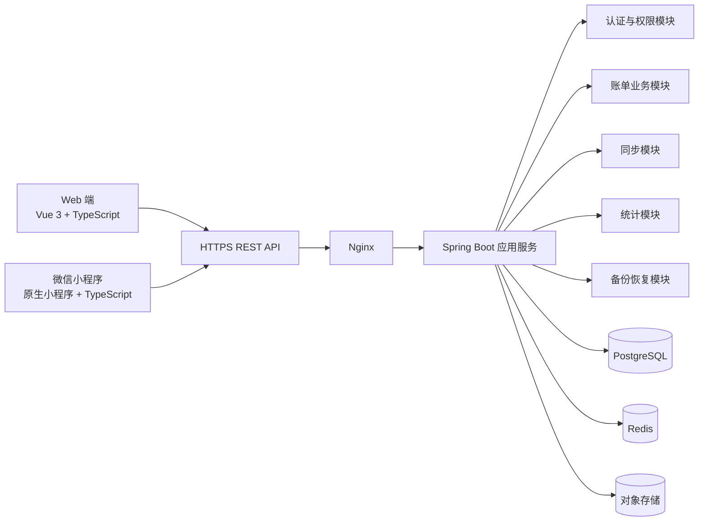
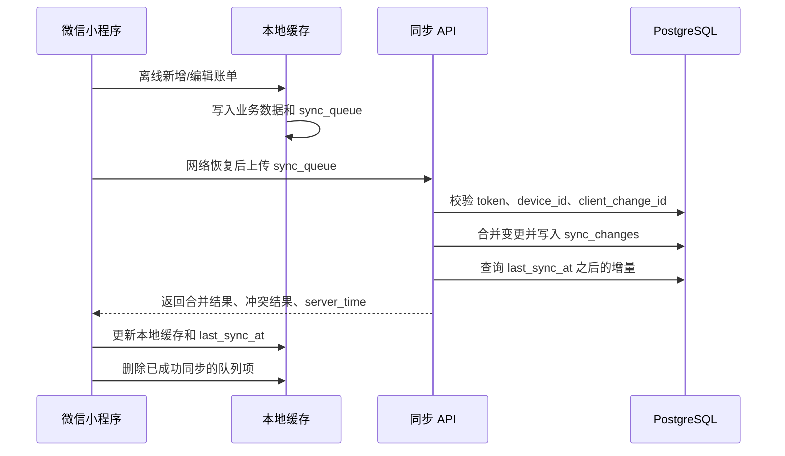
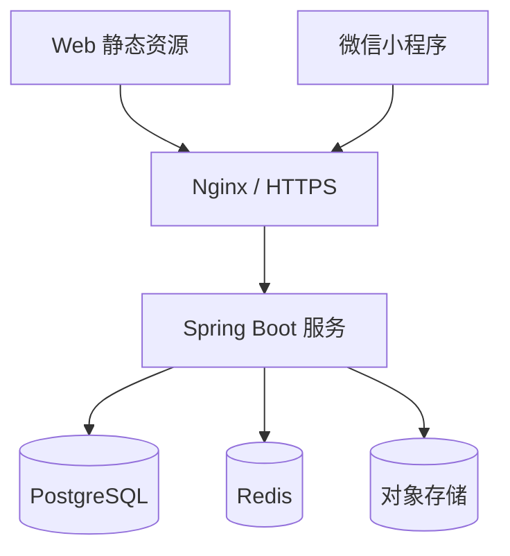

# 个人多端同步记账软件架构文档

## 1. 架构目标

本架构面向个人/家庭记账软件首版 MVP，支撑 Web 端与微信小程序端的多端记账、账单同步、预算管理、统计报表、数据备份与恢复等能力。

架构目标：

- 支持 Web 端和微信小程序端使用同一账号访问同一份账务数据。
- 支持微信小程序离线新增、编辑账单，并在联网后自动同步。
- 支持 Web 端进行账单查看、筛选、统计分析和数据整理。
- 保证用户数据按账号隔离，避免跨用户访问。
- 使用成熟、易招聘、易维护的主流技术栈，降低首版研发风险。
- 首版不引入企业财务、多人协作账本、银行流水自动导入等复杂能力。

## 2. 技术选型

### 2.1 开发语言

| 层级 | 语言 | 说明 |
| --- | --- | --- |
| Web 前端 | TypeScript | 提升前端类型约束和可维护性 |
| 微信小程序 | TypeScript | 使用微信小程序原生能力，减少跨端兼容风险 |
| 后端服务 | Java 17 | 生态成熟，适合业务服务、权限校验、数据一致性处理 |
| 数据库脚本 | SQL | 用于表结构、索引、初始化数据和迁移脚本 |

### 2.2 开发框架与工具

| 模块 | 技术/工具 | 用途 |
| --- | --- | --- |
| Web 前端框架 | Vue 3 + Vite | 构建 Web 端单页应用 |
| Web 状态管理 | Pinia | 管理用户态、账单、预算、同步状态 |
| Web 路由 | Vue Router | 管理首页、账单、统计、预算、设置等页面 |
| Web UI 组件 | Element Plus | 快速搭建表格、表单、筛选器、弹窗等后台型界面 |
| 图表 | ECharts | 展示月度/年度统计、分类占比、趋势图 |
| 微信小程序 | 原生微信小程序 + TypeScript | 提供移动端随手记账体验 |
| 小程序 UI | Vant Weapp | 提供表单、弹窗、选择器、列表等移动端组件 |
| 后端框架 | Spring Boot 3 | 提供 REST API、认证、业务服务、任务处理 |
| 持久层 | MyBatis-Plus | 简化 CRUD、分页、条件查询和表映射 |
| 接口文档 | Springdoc OpenAPI | 自动生成 API 文档，便于前后端联调 |
| 数据库迁移 | Flyway | 管理数据库表结构版本 |
| 构建工具 | Maven | 后端依赖管理与构建 |
| 代码管理 | Git | 版本控制 |
| API 调试 | Apifox 或 Postman | 接口调试、接口用例管理 |
| 设计协作 | Figma 或即时设计 | 页面原型和交互说明 |
| 开发 IDE | IntelliJ IDEA、VS Code、微信开发者工具 | 分别用于后端、Web 前端、小程序开发 |

### 2.3 中间件与基础设施

| 类型 | 选型 | 用途 |
| --- | --- | --- |
| 主数据库 | PostgreSQL 16 | 存储用户、账单、分类、账户、预算、同步日志 |
| 缓存 | Redis 7 | 存储登录会话、验证码、限流计数、短期同步锁 |
| 对象存储 | 阿里云 OSS / 腾讯云 COS / MinIO | 存储用户备份文件 |
| 反向代理 | Nginx | HTTPS 终止、静态资源托管、请求转发 |
| 容器化 | Docker + Docker Compose | 本地开发和测试环境快速启动 |
| 日志 | Logback + JSON 日志 | 服务端结构化日志输出 |
| 监控 | Prometheus + Grafana，可首版后置 | 服务健康、接口耗时、错误率监控 |

### 2.4 选型原则

- Web 端面向桌面整理和统计分析，优先选择 Vue 3 + Element Plus，提升表格、筛选和表单开发效率。
- 微信小程序端面向随手记账，优先使用原生小程序能力，保证登录、缓存、网络状态和微信生态兼容性。
- 后端选择 Spring Boot 单体服务，首版保持部署简单，同时通过模块分层保证后续可拆分。
- PostgreSQL 作为主数据库，适合结构化账务数据、事务处理、统计聚合和索引查询。
- Redis 只承担缓存、会话、限流和短期锁，不作为账务主数据存储。

## 3. 总体架构

系统采用前后端分离架构，客户端包括 Web 端和微信小程序端。两个客户端通过 HTTPS REST API 访问同一个后端服务，后端连接 PostgreSQL、Redis 和对象存储。



## 4. 客户端架构

### 4.1 Web 端架构

Web 端主要用于桌面场景下的账单查看、筛选、统计分析、预算管理和数据整理。

推荐技术栈：

- Vue 3
- TypeScript
- Vite
- Pinia
- Vue Router
- Element Plus
- ECharts
- Axios

Web 端模块：

| 模块 | 职责 |
| --- | --- |
| 登录模块 | 账号登录、退出、登录态刷新 |
| 首页模块 | 展示本月收入、支出、结余、预算进度、近期账单 |
| 账单模块 | 账单列表、筛选、搜索、新增、编辑、删除 |
| 分类模块 | 默认分类展示、自定义分类新增、编辑、停用 |
| 账户模块 | 资金账户新增、编辑、停用、余额展示 |
| 预算模块 | 月度总预算、分类预算配置和进度展示 |
| 统计模块 | 月度统计、年度趋势、分类占比 |
| 设置模块 | 账号信息、同步状态、备份恢复入口 |

Web 本地存储策略：

- 登录令牌存储在安全策略允许的浏览器存储中，优先配合 HttpOnly Cookie 或短期 access token + refresh token。
- 筛选条件、页面偏好可以存储在 localStorage。
- Web 端首版不作为强离线端，不要求完整离线记账能力；断网时提示网络异常。

### 4.2 微信小程序端架构

微信小程序端主要用于移动场景下的快速记账、离线记账、查看近期账单和预算进度。

推荐技术栈：

- 微信原生小程序
- TypeScript
- Vant Weapp
- 微信开发者工具
- `wx.request`
- `wx.setStorage` / `wx.getStorage`
- `wx.getNetworkType` / `wx.onNetworkStatusChange`

小程序端模块：

| 模块 | 职责 |
| --- | --- |
| 登录模块 | 微信授权登录、账号绑定、登录态维护 |
| 快速记账模块 | 收入/支出录入、分类选择、账户选择、备注 |
| 首页模块 | 本月收支、预算进度、同步状态、近期账单 |
| 账单模块 | 账单列表、详情、编辑、删除 |
| 统计模块 | 基础月度统计、分类占比 |
| 设置模块 | 分类管理、账户管理、同步状态、备份恢复 |
| 离线同步模块 | 本地变更队列、网络恢复同步、失败重试 |

小程序本地存储策略：

- 使用微信本地缓存保存近期账单、分类、账户、预算和同步队列。
- 每条本地变更生成 client_change_id，避免重复提交。
- 本地保存 access token、refresh token、device_id 和 last_sync_at。
- 本地缓存容量有限，不建议长期保存全量历史数据；历史查询以服务端分页接口为准。

### 4.3 客户端通用分层

| 层级 | Web 实现 | 小程序实现 | 职责 |
| --- | --- | --- | --- |
| UI 层 | Vue 页面 + Element Plus | 小程序页面 + Vant Weapp | 展示页面、表单、弹窗、图表 |
| 状态层 | Pinia | 页面状态 + 全局 store | 管理用户态、账单、预算、同步状态 |
| API 层 | Axios 封装 | wx.request 封装 | 请求签名、错误处理、令牌刷新 |
| 业务层 | TypeScript service | TypeScript service | 表单校验、金额处理、同步触发 |
| 本地存储层 | localStorage / IndexedDB 可选 | wx storage | 缓存数据、同步队列、设备标识 |

## 5. 服务端架构

### 5.1 后端整体设计

后端采用 Spring Boot 单体模块化架构。首版不拆微服务，避免部署和分布式事务复杂度。代码按业务域拆分包，后续可按模块演进。

推荐包结构：

```text
com.example.accounting
├── auth        # 登录、令牌、权限
├── user        # 用户、设备
├── transaction # 账单
├── category    # 分类
├── account     # 账户
├── budget      # 预算
├── report      # 统计
├── sync        # 多端同步
├── backup      # 备份恢复
├── common      # 通用响应、异常、工具、配置
└── infra       # 数据库、Redis、对象存储、外部客户端
```

### 5.2 服务端模块

| 模块 | 职责 |
| --- | --- |
| 认证模块 | Web 账号登录、微信小程序登录、令牌签发、刷新、退出 |
| 用户模块 | 用户资料、设备注册、账号绑定 |
| 账单模块 | 收入/支出记录新增、编辑、删除、分页查询 |
| 分类模块 | 默认分类、自定义分类、停用分类 |
| 账户模块 | 资金账户管理、账户余额计算 |
| 预算模块 | 月度总预算、分类预算、预算使用进度 |
| 统计模块 | 月度统计、年度统计、分类占比、趋势数据 |
| 同步模块 | 变更上传、冲突合并、增量下发、同步日志 |
| 备份恢复模块 | 手动备份、备份列表、恢复任务 |
| 系统模块 | 统一异常、日志、审计、接口限流 |

### 5.3 API 风格

首版采用 REST API，统一 JSON 请求与响应。

通用响应格式：

```json
{
  "code": "SUCCESS",
  "message": "ok",
  "data": {}
}
```

分页响应格式：

```json
{
  "code": "SUCCESS",
  "message": "ok",
  "data": {
    "items": [],
    "page": 1,
    "pageSize": 20,
    "total": 100
  }
}
```

核心接口分组：

| 分组 | 路径 | 说明 |
| --- | --- | --- |
| 认证 | `/api/auth` | 登录、微信登录、刷新令牌、退出 |
| 用户 | `/api/users/me` | 当前用户信息 |
| 设备 | `/api/devices` | 设备注册、设备状态 |
| 账单 | `/api/transactions` | 账单 CRUD、分页、筛选 |
| 分类 | `/api/categories` | 分类 CRUD、停用 |
| 账户 | `/api/accounts` | 账户 CRUD、停用 |
| 预算 | `/api/budgets` | 预算配置、预算进度 |
| 统计 | `/api/reports` | 月度统计、年度统计、分类占比 |
| 同步 | `/api/sync` | 上传变更、拉取增量 |
| 备份 | `/api/backups` | 备份创建、列表、恢复 |

### 5.4 认证方案

Web 端：

- 支持手机号/邮箱 + 密码登录。
- 使用 access token + refresh token。
- access token 有效期较短，refresh token 用于续期。

微信小程序端：

- 使用 `wx.login` 获取临时 code。
- 后端调用微信接口换取 openid。
- 首次登录时创建或绑定用户账号。
- 后端返回 access token、refresh token 和 device_id。

服务端权限规则：

- 所有业务接口必须登录。
- user_id 从 token 中解析，不能信任客户端传入。
- 所有查询和写入必须带 user_id 条件。
- 备份下载和恢复必须二次校验备份归属。

## 6. 数据库架构

### 6.1 数据库选型

主数据库使用 PostgreSQL 16。

选择原因：

- 支持事务，适合账单、账户余额、预算等一致性要求。
- 支持复杂聚合查询，适合统计报表。
- 支持 JSONB，可用于存储备份元信息、设备信息等扩展字段。
- 索引能力成熟，适合按用户、时间、分类、账户组合查询。

### 6.2 核心数据表

| 表 | 说明 |
| --- | --- |
| users | 用户账号与基础信息 |
| user_auth_identities | 用户登录身份，例如密码账号、微信 openid |
| devices | 用户登录设备与同步标识 |
| transactions | 收入/支出账单 |
| categories | 收入/支出分类 |
| accounts | 资金账户 |
| budgets | 月度总预算与分类预算 |
| sync_changes | 服务端变更日志，用于增量同步 |
| client_change_logs | 客户端变更去重记录 |
| backup_jobs | 备份任务与备份文件记录 |

### 6.3 关键字段

#### users

| 字段 | 类型建议 | 说明 |
| --- | --- | --- |
| id | bigint / uuid | 用户 ID |
| nickname | varchar | 昵称 |
| avatar_url | varchar | 头像 |
| status | varchar | normal、disabled |
| created_at | timestamp | 创建时间 |
| updated_at | timestamp | 更新时间 |

#### user_auth_identities

| 字段 | 类型建议 | 说明 |
| --- | --- | --- |
| id | bigint / uuid | 认证身份 ID |
| user_id | bigint / uuid | 用户 ID |
| identity_type | varchar | password、wechat_mini |
| identifier | varchar | 手机号、邮箱、openid 等 |
| credential_hash | varchar | 密码哈希，微信登录为空 |
| created_at | timestamp | 创建时间 |

#### devices

| 字段 | 类型建议 | 说明 |
| --- | --- | --- |
| id | bigint / uuid | 设备 ID |
| user_id | bigint / uuid | 用户 ID |
| platform | varchar | web、wechat_mini |
| device_name | varchar | 设备名称 |
| last_sync_at | timestamp | 最近同步时间 |
| created_at | timestamp | 创建时间 |
| updated_at | timestamp | 更新时间 |

#### transactions

| 字段 | 类型建议 | 说明 |
| --- | --- | --- |
| id | bigint / uuid | 账单 ID |
| user_id | bigint / uuid | 用户 ID |
| amount_cent | bigint | 金额，单位为分 |
| type | varchar | income、expense |
| category_id | bigint / uuid | 分类 ID |
| account_id | bigint / uuid | 账户 ID |
| occurred_at | timestamp | 发生时间 |
| note | varchar | 备注 |
| is_deleted | boolean | 是否逻辑删除 |
| created_at | timestamp | 创建时间 |
| updated_at | timestamp | 更新时间 |

#### categories

| 字段 | 类型建议 | 说明 |
| --- | --- | --- |
| id | bigint / uuid | 分类 ID |
| user_id | bigint / uuid | 用户 ID |
| name | varchar | 分类名称 |
| type | varchar | income、expense |
| is_default | boolean | 是否默认分类 |
| is_disabled | boolean | 是否停用 |
| sort_order | integer | 排序 |
| created_at | timestamp | 创建时间 |
| updated_at | timestamp | 更新时间 |

#### accounts

| 字段 | 类型建议 | 说明 |
| --- | --- | --- |
| id | bigint / uuid | 账户 ID |
| user_id | bigint / uuid | 用户 ID |
| name | varchar | 账户名称 |
| type | varchar | cash、bank_card、e_wallet、other |
| initial_balance_cent | bigint | 初始余额，单位为分 |
| current_balance_cent | bigint | 当前余额，单位为分 |
| is_disabled | boolean | 是否停用 |
| created_at | timestamp | 创建时间 |
| updated_at | timestamp | 更新时间 |

#### budgets

| 字段 | 类型建议 | 说明 |
| --- | --- | --- |
| id | bigint / uuid | 预算 ID |
| user_id | bigint / uuid | 用户 ID |
| month | char(7) | 预算月份，例如 2026-06 |
| type | varchar | total、category |
| category_id | bigint / uuid | 分类预算对应分类，总预算为空 |
| amount_cent | bigint | 预算金额，单位为分 |
| created_at | timestamp | 创建时间 |
| updated_at | timestamp | 更新时间 |

#### sync_changes

| 字段 | 类型建议 | 说明 |
| --- | --- | --- |
| id | bigint / uuid | 同步变更 ID |
| user_id | bigint / uuid | 用户 ID |
| entity_type | varchar | transaction、category、account、budget |
| entity_id | bigint / uuid | 业务数据 ID |
| operation | varchar | create、update、delete |
| changed_at | timestamp | 变更时间 |
| device_id | bigint / uuid | 变更来源设备 |

#### client_change_logs

| 字段 | 类型建议 | 说明 |
| --- | --- | --- |
| id | bigint / uuid | 日志 ID |
| user_id | bigint / uuid | 用户 ID |
| device_id | bigint / uuid | 设备 ID |
| client_change_id | varchar | 客户端变更唯一 ID |
| status | varchar | success、failed |
| created_at | timestamp | 创建时间 |

#### backup_jobs

| 字段 | 类型建议 | 说明 |
| --- | --- | --- |
| id | bigint / uuid | 备份任务 ID |
| user_id | bigint / uuid | 用户 ID |
| status | varchar | pending、running、success、failed |
| file_url | varchar | 备份文件存储地址 |
| file_size | bigint | 文件大小 |
| created_at | timestamp | 创建时间 |
| completed_at | timestamp | 完成时间 |

### 6.4 索引建议

- `transactions(user_id, occurred_at desc)`：账单列表和月度查询。
- `transactions(user_id, type, occurred_at desc)`：按收入/支出筛选。
- `transactions(user_id, category_id, occurred_at desc)`：按分类筛选。
- `transactions(user_id, account_id, occurred_at desc)`：按账户筛选。
- `categories(user_id, type, is_disabled)`：记账分类选择。
- `accounts(user_id, is_disabled)`：账户选择。
- `budgets(user_id, month)`：预算查询。
- `sync_changes(user_id, changed_at)`：增量同步。
- `client_change_logs(user_id, device_id, client_change_id)`：客户端变更去重，需唯一索引。

## 7. 多端同步架构

### 7.1 同步范围

首版同步以下数据：

- transactions
- categories
- accounts
- budgets

不需要同步的数据：

- Web 页面筛选条件。
- 小程序本地 UI 状态。
- 服务端备份文件内容本身。

### 7.2 同步原则

- 服务端数据库是最终数据源。
- 小程序端支持离线写入，Web 端首版不要求离线写入。
- 每台客户端设备有唯一 device_id。
- 每次客户端本地变更生成唯一 client_change_id。
- 客户端上传变更时，服务端根据 client_change_id 去重。
- 普通冲突采用最后更新时间优先。

### 7.3 同步流程



### 7.4 冲突处理规则

| 场景 | 首版处理方式 |
| --- | --- |
| 多端同时编辑同一条账单 | 以 updated_at 较新的版本为准 |
| 一端删除，另一端编辑 | 以 updated_at 较新的操作为准 |
| 客户端重复上传同一变更 | 根据 client_change_id 幂等返回成功 |
| 服务端数据已不存在 | 返回冲突结果，客户端移除或提示用户 |
| 同步失败 | 保留本地队列，网络恢复后重试 |

### 7.5 小程序本地同步队列结构

```json
{
  "clientChangeId": "uuid",
  "entityType": "transaction",
  "entityId": "local-or-server-id",
  "operation": "create",
  "payload": {},
  "changedAt": "2026-06-15T12:00:00+08:00",
  "retryCount": 0
}
```

## 8. 统计与预算架构

### 8.1 统计计算

首版统计由服务端基于 PostgreSQL 聚合计算，客户端负责展示。

统计接口：

- 月度收支汇总。
- 月度支出分类占比。
- 年度每月收入、支出、结余趋势。
- 账户余额汇总。

小程序离线时，可以基于本地缓存计算临时月度统计；联网同步后以服务端结果覆盖。

### 8.2 预算计算

- 月度总预算按当月所有支出账单汇总。
- 分类预算按当月指定支出分类账单汇总。
- 服务端返回预算金额、已使用金额、剩余金额、使用比例。
- 前端根据使用比例展示正常、接近超限、已超限状态。

## 9. 备份与恢复架构

### 9.1 备份流程

- 用户在设置页手动发起备份。
- 后端创建 backup_jobs 记录，状态为 pending。
- 后端导出当前用户的账单、分类、账户、预算数据为 JSON 文件。
- 备份文件上传至对象存储。
- backup_jobs 更新为 success 或 failed。

### 9.2 恢复流程

- 用户选择备份记录并确认恢复。
- 后端校验备份归属当前用户。
- 后端在事务中恢复账单、分类、账户、预算数据。
- 恢复完成后写入 sync_changes，触发 Web 和小程序重新拉取数据。
- 客户端展示恢复成功，并刷新本地缓存。

### 9.3 备份文件格式

```json
{
  "version": "1.0",
  "userId": "user-id",
  "createdAt": "2026-06-15T12:00:00+08:00",
  "transactions": [],
  "categories": [],
  "accounts": [],
  "budgets": []
}
```

## 10. 安全架构

### 10.1 传输与认证

- 所有接口必须使用 HTTPS。
- access token 有效期建议 2 小时。
- refresh token 有效期建议 30 天。
- refresh token 需要支持服务端失效，用于退出登录和风险控制。
- 微信小程序登录必须由后端使用 code 换取 openid，不允许客户端自行伪造用户身份。

### 10.2 数据权限

- 所有业务表按 user_id 隔离。
- 后端查询必须使用 token 解析出的 user_id。
- 禁止前端传入 user_id 作为权限依据。
- 备份文件下载和恢复必须校验 user_id。

### 10.3 敏感信息

- 密码使用 BCrypt 或 Argon2 哈希存储。
- 日志中不记录密码、token、完整账单备注、备份文件内容。
- 对象存储文件使用私有读写权限。
- 备份文件下载链接应设置短有效期。

## 11. 部署架构

### 11.1 开发环境

开发环境建议使用 Docker Compose 启动 PostgreSQL、Redis、MinIO，后端和前端在本机运行。

开发工具：

- IntelliJ IDEA：后端开发。
- VS Code：Web 前端开发。
- 微信开发者工具：微信小程序开发与预览。
- Docker Desktop：本地中间件。
- Apifox/Postman：接口调试。
- DBeaver：数据库查看与调试。

### 11.2 测试/生产环境



部署建议：

- Web 静态资源由 Nginx 或对象存储静态托管。
- 小程序发布到微信公众平台。
- Spring Boot 服务以 Docker 容器部署。
- PostgreSQL 和 Redis 可使用云厂商托管服务，降低运维成本。
- 对象存储使用云厂商 OSS/COS，生产环境不建议使用本地磁盘存储备份。

## 12. 目录结构建议

### 12.1 后端目录

```text
backend/
├── src/main/java/com/example/accounting/
│   ├── auth/
│   ├── user/
│   ├── transaction/
│   ├── category/
│   ├── account/
│   ├── budget/
│   ├── report/
│   ├── sync/
│   ├── backup/
│   ├── common/
│   └── infra/
├── src/main/resources/
│   ├── db/migration/
│   └── application.yml
└── pom.xml
```

### 12.2 Web 端目录

```text
web/
├── src/
│   ├── api/
│   ├── assets/
│   ├── components/
│   ├── pages/
│   ├── router/
│   ├── stores/
│   ├── services/
│   └── utils/
├── index.html
├── package.json
└── vite.config.ts
```

### 12.3 微信小程序目录

```text
miniprogram/
├── pages/
│   ├── home/
│   ├── transaction-edit/
│   ├── transactions/
│   ├── reports/
│   ├── budget/
│   └── settings/
├── components/
├── services/
├── stores/
├── utils/
├── app.ts
├── app.json
└── project.config.json
```

## 13. 非功能设计

### 13.1 性能

- 账单列表必须分页，默认每页 20 条。
- 账单按 `occurred_at desc` 展示。
- 月度统计优先由数据库聚合计算。
- Web 端表格筛选走服务端查询，不一次性加载全量账单。
- 小程序端只缓存近期数据和必要基础数据，避免本地缓存过大。

### 13.2 可用性

- 小程序端离线记账必须可用。
- 同步失败不影响用户继续新增本地账单。
- 登录过期时前端应自动尝试刷新令牌。
- 服务端错误响应必须包含可识别错误码。

### 13.3 可维护性

- 后端按业务模块拆分，禁止所有逻辑堆在 controller。
- 前端 API 请求统一封装，统一处理 token、错误提示和重试。
- 统计规则集中在服务端 report 模块。
- 同步逻辑集中在 sync 模块，不散落到普通 CRUD 接口中。

### 13.4 可观测性

- 服务端记录接口耗时、错误码、用户 ID、请求 ID。
- 同步接口记录 device_id、上传数量、下发数量、失败原因。
- 备份恢复记录任务状态和错误信息。
- 生产环境应保留错误日志，便于排查用户数据问题。

## 14. 首版不包含的架构能力

- 原生 iOS App 和 Android App。
- 桌面客户端。
- 企业会计科目、凭证和专业财务报表。
- 多人协作账本与复杂权限体系。
- 银行流水或支付平台自动导入。
- 投资理财交易系统。
- OCR 发票识别服务。
- 复杂审批、报销、税务流程。
