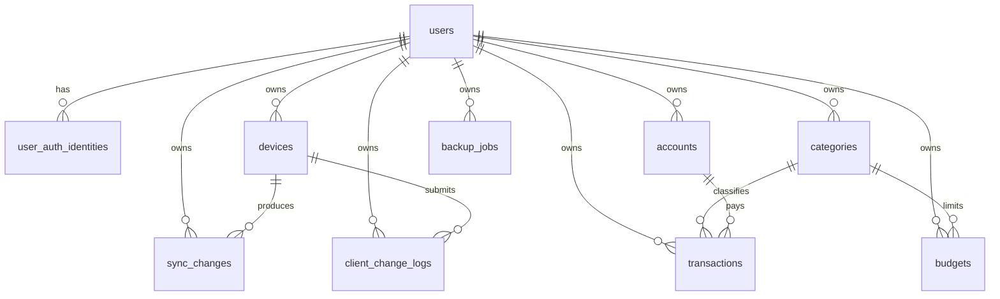

# 数据库设计文档

本文档基于 `ARCH.md` 中的数据库架构，定义个人多端同步记账软件首版 MVP 的 PostgreSQL 数据库设计。设计目标是支撑用户数据隔离、账单 CRUD、账户余额、分类与预算、增量同步、备份恢复和基础统计。

## 1. 设计目标

- 使用 PostgreSQL 16 存储核心账务数据。
- 所有业务数据按 `user_id` 隔离，禁止跨用户访问。
- 金额统一使用整数分存储，避免浮点误差。
- 账单、账户余额、同步日志写入保持事务一致。
- 小程序离线变更通过 `client_change_id` 幂等去重。
- 首版采用逻辑删除账单，保留同步和恢复能力。

## 2. 基本约定

### 2.1 命名约定

- 表名使用复数蛇形命名，例如 `transactions`。
- 字段名使用蛇形命名，例如 `amount_cent`。
- 主键字段统一命名为 `id`。
- 外键字段使用 `{entity}_id`，例如 `category_id`。
- 创建时间字段：`created_at`。
- 更新时间字段：`updated_at`。

### 2.2 ID 策略

首版建议使用 UUID 作为主键：

- 方便小程序离线场景生成本地实体 ID。
- 减少多端同步时临时 ID 与服务端 ID 映射复杂度。
- PostgreSQL 可使用 `gen_random_uuid()` 生成默认值。

推荐启用扩展：

```sql
CREATE EXTENSION IF NOT EXISTS pgcrypto;
```

如果团队更偏好 bigint 自增，也应保留 `client_change_id` 与本地临时 ID 映射机制。

### 2.3 金额与时间

- 金额字段统一使用 `bigint`，单位为分。
- 时间字段建议使用 `timestamptz`。
- 服务端统一写入数据库当前时间，客户端时间只用于同步冲突判断和展示辅助。

### 2.4 软删除

- `transactions` 使用 `is_deleted` 表示逻辑删除。
- 分类、账户使用 `is_disabled` 表示停用，不删除历史引用。
- 用户首版不做物理删除，禁用使用 `status = 'disabled'`。

### 2.5 多租户隔离

所有业务表必须包含 `user_id`：

- 查询时必须带 `user_id = 当前登录用户`。
- 更新和删除时必须同时匹配 `id` 与 `user_id`。
- 外键只能保证关系存在，不能替代业务层的用户归属校验。

## 3. 实体关系概览



## 4. 表结构设计

### 4.1 users

用户账号基础信息。

| 字段 | 类型 | 必填 | 默认值 | 说明 |
| --- | --- | --- | --- | --- |
| `id` | uuid | 是 | `gen_random_uuid()` | 用户 ID |
| `nickname` | varchar(64) | 否 | null | 昵称 |
| `avatar_url` | varchar(512) | 否 | null | 头像 URL |
| `status` | varchar(32) | 是 | `normal` | `normal`、`disabled` |
| `created_at` | timestamptz | 是 | `now()` | 创建时间 |
| `updated_at` | timestamptz | 是 | `now()` | 更新时间 |

约束：

- `status in ('normal', 'disabled')`

建议 DDL：

```sql
CREATE TABLE users (
    id uuid PRIMARY KEY DEFAULT gen_random_uuid(),
    nickname varchar(64),
    avatar_url varchar(512),
    status varchar(32) NOT NULL DEFAULT 'normal',
    created_at timestamptz NOT NULL DEFAULT now(),
    updated_at timestamptz NOT NULL DEFAULT now(),
    CONSTRAINT ck_users_status CHECK (status IN ('normal', 'disabled'))
);
```

### 4.2 user_auth_identities

用户登录身份。一个用户可绑定多个登录身份，例如密码账号和微信小程序 openid。

| 字段 | 类型 | 必填 | 默认值 | 说明 |
| --- | --- | --- | --- | --- |
| `id` | uuid | 是 | `gen_random_uuid()` | 认证身份 ID |
| `user_id` | uuid | 是 | - | 用户 ID |
| `identity_type` | varchar(32) | 是 | - | `password`、`wechat_mini` |
| `identifier` | varchar(255) | 是 | - | 手机号、邮箱、openid |
| `credential_hash` | varchar(255) | 否 | null | 密码哈希，微信登录为空 |
| `created_at` | timestamptz | 是 | `now()` | 创建时间 |

约束：

- `identity_type in ('password', 'wechat_mini')`
- `(identity_type, identifier)` 唯一
- `user_id` 引用 `users(id)`

建议 DDL：

```sql
CREATE TABLE user_auth_identities (
    id uuid PRIMARY KEY DEFAULT gen_random_uuid(),
    user_id uuid NOT NULL REFERENCES users(id),
    identity_type varchar(32) NOT NULL,
    identifier varchar(255) NOT NULL,
    credential_hash varchar(255),
    created_at timestamptz NOT NULL DEFAULT now(),
    CONSTRAINT ck_user_auth_identity_type CHECK (identity_type IN ('password', 'wechat_mini')),
    CONSTRAINT uk_user_auth_identity_identifier UNIQUE (identity_type, identifier)
);
```

### 4.3 devices

用户登录设备和同步状态。

| 字段 | 类型 | 必填 | 默认值 | 说明 |
| --- | --- | --- | --- | --- |
| `id` | uuid | 是 | `gen_random_uuid()` | 设备 ID |
| `user_id` | uuid | 是 | - | 用户 ID |
| `platform` | varchar(32) | 是 | - | `web`、`wechat_mini` |
| `device_name` | varchar(128) | 否 | null | 设备名称 |
| `device_info` | jsonb | 否 | null | 设备扩展信息 |
| `last_sync_at` | timestamptz | 否 | null | 最近同步时间 |
| `created_at` | timestamptz | 是 | `now()` | 创建时间 |
| `updated_at` | timestamptz | 是 | `now()` | 更新时间 |

约束：

- `platform in ('web', 'wechat_mini')`
- `user_id` 引用 `users(id)`

建议 DDL：

```sql
CREATE TABLE devices (
    id uuid PRIMARY KEY DEFAULT gen_random_uuid(),
    user_id uuid NOT NULL REFERENCES users(id),
    platform varchar(32) NOT NULL,
    device_name varchar(128),
    device_info jsonb,
    last_sync_at timestamptz,
    created_at timestamptz NOT NULL DEFAULT now(),
    updated_at timestamptz NOT NULL DEFAULT now(),
    CONSTRAINT ck_devices_platform CHECK (platform IN ('web', 'wechat_mini'))
);
```

### 4.4 categories

收入和支出分类。默认分类和用户自定义分类统一存储。

| 字段 | 类型 | 必填 | 默认值 | 说明 |
| --- | --- | --- | --- | --- |
| `id` | uuid | 是 | `gen_random_uuid()` | 分类 ID |
| `user_id` | uuid | 是 | - | 用户 ID |
| `name` | varchar(64) | 是 | - | 分类名称 |
| `type` | varchar(16) | 是 | - | `income`、`expense` |
| `is_default` | boolean | 是 | `false` | 是否默认分类 |
| `is_disabled` | boolean | 是 | `false` | 是否停用 |
| `sort_order` | integer | 是 | `0` | 排序值 |
| `created_at` | timestamptz | 是 | `now()` | 创建时间 |
| `updated_at` | timestamptz | 是 | `now()` | 更新时间 |

约束：

- `type in ('income', 'expense')`
- 同一用户下，同类型分类名称建议唯一。
- `user_id` 引用 `users(id)`

建议 DDL：

```sql
CREATE TABLE categories (
    id uuid PRIMARY KEY DEFAULT gen_random_uuid(),
    user_id uuid NOT NULL REFERENCES users(id),
    name varchar(64) NOT NULL,
    type varchar(16) NOT NULL,
    is_default boolean NOT NULL DEFAULT false,
    is_disabled boolean NOT NULL DEFAULT false,
    sort_order integer NOT NULL DEFAULT 0,
    created_at timestamptz NOT NULL DEFAULT now(),
    updated_at timestamptz NOT NULL DEFAULT now(),
    CONSTRAINT ck_categories_type CHECK (type IN ('income', 'expense')),
    CONSTRAINT uk_categories_user_type_name UNIQUE (user_id, type, name)
);
```

### 4.5 accounts

资金账户，例如现金、银行卡、电子钱包。

| 字段 | 类型 | 必填 | 默认值 | 说明 |
| --- | --- | --- | --- | --- |
| `id` | uuid | 是 | `gen_random_uuid()` | 账户 ID |
| `user_id` | uuid | 是 | - | 用户 ID |
| `name` | varchar(64) | 是 | - | 账户名称 |
| `type` | varchar(32) | 是 | - | `cash`、`bank_card`、`e_wallet`、`other` |
| `initial_balance_cent` | bigint | 是 | `0` | 初始余额 |
| `current_balance_cent` | bigint | 是 | `0` | 当前余额 |
| `is_disabled` | boolean | 是 | `false` | 是否停用 |
| `created_at` | timestamptz | 是 | `now()` | 创建时间 |
| `updated_at` | timestamptz | 是 | `now()` | 更新时间 |

约束：

- `type in ('cash', 'bank_card', 'e_wallet', 'other')`
- 同一用户下账户名称建议唯一。
- `user_id` 引用 `users(id)`

建议 DDL：

```sql
CREATE TABLE accounts (
    id uuid PRIMARY KEY DEFAULT gen_random_uuid(),
    user_id uuid NOT NULL REFERENCES users(id),
    name varchar(64) NOT NULL,
    type varchar(32) NOT NULL,
    initial_balance_cent bigint NOT NULL DEFAULT 0,
    current_balance_cent bigint NOT NULL DEFAULT 0,
    is_disabled boolean NOT NULL DEFAULT false,
    created_at timestamptz NOT NULL DEFAULT now(),
    updated_at timestamptz NOT NULL DEFAULT now(),
    CONSTRAINT ck_accounts_type CHECK (type IN ('cash', 'bank_card', 'e_wallet', 'other')),
    CONSTRAINT uk_accounts_user_name UNIQUE (user_id, name)
);
```

### 4.6 transactions

收入和支出账单。

| 字段 | 类型 | 必填 | 默认值 | 说明 |
| --- | --- | --- | --- | --- |
| `id` | uuid | 是 | `gen_random_uuid()` | 账单 ID |
| `user_id` | uuid | 是 | - | 用户 ID |
| `amount_cent` | bigint | 是 | - | 金额，单位为分 |
| `type` | varchar(16) | 是 | - | `income`、`expense` |
| `category_id` | uuid | 是 | - | 分类 ID |
| `account_id` | uuid | 是 | - | 账户 ID |
| `occurred_at` | timestamptz | 是 | - | 发生时间 |
| `note` | varchar(255) | 否 | null | 备注 |
| `is_deleted` | boolean | 是 | `false` | 是否逻辑删除 |
| `created_at` | timestamptz | 是 | `now()` | 创建时间 |
| `updated_at` | timestamptz | 是 | `now()` | 更新时间 |

约束：

- `amount_cent > 0`
- `type in ('income', 'expense')`
- `category_id` 引用 `categories(id)`
- `account_id` 引用 `accounts(id)`
- 写入时业务层必须校验分类、账户均属于当前用户。

建议 DDL：

```sql
CREATE TABLE transactions (
    id uuid PRIMARY KEY DEFAULT gen_random_uuid(),
    user_id uuid NOT NULL REFERENCES users(id),
    amount_cent bigint NOT NULL,
    type varchar(16) NOT NULL,
    category_id uuid NOT NULL REFERENCES categories(id),
    account_id uuid NOT NULL REFERENCES accounts(id),
    occurred_at timestamptz NOT NULL,
    note varchar(255),
    is_deleted boolean NOT NULL DEFAULT false,
    created_at timestamptz NOT NULL DEFAULT now(),
    updated_at timestamptz NOT NULL DEFAULT now(),
    CONSTRAINT ck_transactions_amount CHECK (amount_cent > 0),
    CONSTRAINT ck_transactions_type CHECK (type IN ('income', 'expense'))
);
```

### 4.7 budgets

月度总预算和分类预算。

| 字段 | 类型 | 必填 | 默认值 | 说明 |
| --- | --- | --- | --- | --- |
| `id` | uuid | 是 | `gen_random_uuid()` | 预算 ID |
| `user_id` | uuid | 是 | - | 用户 ID |
| `month` | char(7) | 是 | - | 月份，格式 `yyyy-MM` |
| `type` | varchar(16) | 是 | - | `total`、`category` |
| `category_id` | uuid | 否 | null | 分类预算对应分类 |
| `amount_cent` | bigint | 是 | - | 预算金额 |
| `created_at` | timestamptz | 是 | `now()` | 创建时间 |
| `updated_at` | timestamptz | 是 | `now()` | 更新时间 |

约束：

- `amount_cent >= 0`
- `type in ('total', 'category')`
- `type = 'total'` 时 `category_id is null`
- `type = 'category'` 时 `category_id is not null`
- 同一用户同一月份只能有一个总预算。
- 同一用户同一月份同一分类只能有一个分类预算。

建议 DDL：

```sql
CREATE TABLE budgets (
    id uuid PRIMARY KEY DEFAULT gen_random_uuid(),
    user_id uuid NOT NULL REFERENCES users(id),
    month char(7) NOT NULL,
    type varchar(16) NOT NULL,
    category_id uuid REFERENCES categories(id),
    amount_cent bigint NOT NULL,
    created_at timestamptz NOT NULL DEFAULT now(),
    updated_at timestamptz NOT NULL DEFAULT now(),
    CONSTRAINT ck_budgets_amount CHECK (amount_cent >= 0),
    CONSTRAINT ck_budgets_type CHECK (type IN ('total', 'category')),
    CONSTRAINT ck_budgets_category_required CHECK (
        (type = 'total' AND category_id IS NULL)
        OR (type = 'category' AND category_id IS NOT NULL)
    )
);

CREATE UNIQUE INDEX uk_budgets_user_month_total
ON budgets (user_id, month)
WHERE type = 'total';

CREATE UNIQUE INDEX uk_budgets_user_month_category
ON budgets (user_id, month, category_id)
WHERE type = 'category';
```

### 4.8 sync_changes

服务端变更日志，用于多端增量同步。

| 字段 | 类型 | 必填 | 默认值 | 说明 |
| --- | --- | --- | --- | --- |
| `id` | uuid | 是 | `gen_random_uuid()` | 变更 ID |
| `user_id` | uuid | 是 | - | 用户 ID |
| `entity_type` | varchar(32) | 是 | - | `transaction`、`category`、`account`、`budget` |
| `entity_id` | uuid | 是 | - | 业务实体 ID |
| `operation` | varchar(16) | 是 | - | `create`、`update`、`delete` |
| `payload` | jsonb | 否 | null | 变更后的实体快照或删除摘要 |
| `changed_at` | timestamptz | 是 | `now()` | 服务端变更时间 |
| `device_id` | uuid | 否 | null | 变更来源设备 |

约束：

- `entity_type in ('transaction', 'category', 'account', 'budget')`
- `operation in ('create', 'update', 'delete')`
- `user_id` 引用 `users(id)`
- `device_id` 引用 `devices(id)`

建议 DDL：

```sql
CREATE TABLE sync_changes (
    id uuid PRIMARY KEY DEFAULT gen_random_uuid(),
    user_id uuid NOT NULL REFERENCES users(id),
    entity_type varchar(32) NOT NULL,
    entity_id uuid NOT NULL,
    operation varchar(16) NOT NULL,
    payload jsonb,
    changed_at timestamptz NOT NULL DEFAULT now(),
    device_id uuid REFERENCES devices(id),
    CONSTRAINT ck_sync_changes_entity_type CHECK (
        entity_type IN ('transaction', 'category', 'account', 'budget')
    ),
    CONSTRAINT ck_sync_changes_operation CHECK (
        operation IN ('create', 'update', 'delete')
    )
);
```

### 4.9 client_change_logs

客户端变更去重记录。小程序离线队列重复上传时，服务端通过 `client_change_id` 幂等处理。

| 字段 | 类型 | 必填 | 默认值 | 说明 |
| --- | --- | --- | --- | --- |
| `id` | uuid | 是 | `gen_random_uuid()` | 日志 ID |
| `user_id` | uuid | 是 | - | 用户 ID |
| `device_id` | uuid | 是 | - | 设备 ID |
| `client_change_id` | varchar(64) | 是 | - | 客户端变更唯一 ID |
| `entity_type` | varchar(32) | 是 | - | 变更实体类型 |
| `entity_id` | uuid | 否 | null | 服务端实体 ID |
| `operation` | varchar(16) | 是 | - | 变更操作 |
| `status` | varchar(16) | 是 | - | `success`、`failed` |
| `error_code` | varchar(64) | 否 | null | 失败错误码 |
| `created_at` | timestamptz | 是 | `now()` | 创建时间 |

约束：

- `(user_id, device_id, client_change_id)` 唯一
- `status in ('success', 'failed')`

建议 DDL：

```sql
CREATE TABLE client_change_logs (
    id uuid PRIMARY KEY DEFAULT gen_random_uuid(),
    user_id uuid NOT NULL REFERENCES users(id),
    device_id uuid NOT NULL REFERENCES devices(id),
    client_change_id varchar(64) NOT NULL,
    entity_type varchar(32) NOT NULL,
    entity_id uuid,
    operation varchar(16) NOT NULL,
    status varchar(16) NOT NULL,
    error_code varchar(64),
    created_at timestamptz NOT NULL DEFAULT now(),
    CONSTRAINT ck_client_change_logs_status CHECK (status IN ('success', 'failed')),
    CONSTRAINT uk_client_change_logs_dedup UNIQUE (user_id, device_id, client_change_id)
);
```

### 4.10 backup_jobs

备份任务与备份文件记录。

| 字段 | 类型 | 必填 | 默认值 | 说明 |
| --- | --- | --- | --- | --- |
| `id` | uuid | 是 | `gen_random_uuid()` | 备份任务 ID |
| `user_id` | uuid | 是 | - | 用户 ID |
| `status` | varchar(16) | 是 | `pending` | `pending`、`running`、`success`、`failed` |
| `file_url` | varchar(1024) | 否 | null | 对象存储地址 |
| `file_size` | bigint | 否 | null | 文件大小 |
| `metadata` | jsonb | 否 | null | 备份统计、版本等扩展信息 |
| `error_message` | varchar(1024) | 否 | null | 失败原因 |
| `created_at` | timestamptz | 是 | `now()` | 创建时间 |
| `completed_at` | timestamptz | 否 | null | 完成时间 |

约束：

- `status in ('pending', 'running', 'success', 'failed')`
- `file_size is null or file_size >= 0`

建议 DDL：

```sql
CREATE TABLE backup_jobs (
    id uuid PRIMARY KEY DEFAULT gen_random_uuid(),
    user_id uuid NOT NULL REFERENCES users(id),
    status varchar(16) NOT NULL DEFAULT 'pending',
    file_url varchar(1024),
    file_size bigint,
    metadata jsonb,
    error_message varchar(1024),
    created_at timestamptz NOT NULL DEFAULT now(),
    completed_at timestamptz,
    CONSTRAINT ck_backup_jobs_status CHECK (status IN ('pending', 'running', 'success', 'failed')),
    CONSTRAINT ck_backup_jobs_file_size CHECK (file_size IS NULL OR file_size >= 0)
);
```

## 5. 索引设计

### 5.1 认证与用户

```sql
CREATE INDEX idx_user_auth_identities_user_id
ON user_auth_identities (user_id);

CREATE INDEX idx_devices_user_platform
ON devices (user_id, platform);
```

### 5.2 账单查询

```sql
CREATE INDEX idx_transactions_user_occurred_at
ON transactions (user_id, occurred_at DESC)
WHERE is_deleted = false;

CREATE INDEX idx_transactions_user_type_occurred_at
ON transactions (user_id, type, occurred_at DESC)
WHERE is_deleted = false;

CREATE INDEX idx_transactions_user_category_occurred_at
ON transactions (user_id, category_id, occurred_at DESC)
WHERE is_deleted = false;

CREATE INDEX idx_transactions_user_account_occurred_at
ON transactions (user_id, account_id, occurred_at DESC)
WHERE is_deleted = false;
```

用途：

- 账单分页列表。
- 按收入/支出筛选。
- 按分类、账户筛选。
- 月度统计范围查询。

### 5.3 分类、账户、预算

```sql
CREATE INDEX idx_categories_user_type_disabled
ON categories (user_id, type, is_disabled, sort_order);

CREATE INDEX idx_accounts_user_disabled
ON accounts (user_id, is_disabled);

CREATE INDEX idx_budgets_user_month
ON budgets (user_id, month);
```

### 5.4 同步与备份

```sql
CREATE INDEX idx_sync_changes_user_changed_at
ON sync_changes (user_id, changed_at, id);

CREATE INDEX idx_sync_changes_user_entity
ON sync_changes (user_id, entity_type, entity_id);

CREATE INDEX idx_client_change_logs_user_device_created
ON client_change_logs (user_id, device_id, created_at DESC);

CREATE INDEX idx_backup_jobs_user_created
ON backup_jobs (user_id, created_at DESC);
```

## 6. 事务与一致性规则

### 6.1 创建账单

创建账单必须在同一事务内完成：

1. 校验分类和账户属于当前用户且未停用。
2. 写入 `transactions`。
3. 更新 `accounts.current_balance_cent`。
4. 写入 `sync_changes`。

账户余额更新规则：

- 收入：`current_balance_cent += amount_cent`
- 支出：`current_balance_cent -= amount_cent`

### 6.2 更新账单

更新账单必须在同一事务内完成：

1. 查询旧账单并锁定，建议使用 `SELECT ... FOR UPDATE`。
2. 回滚旧账单对旧账户余额的影响。
3. 校验新分类和新账户归属。
4. 更新账单字段和 `updated_at`。
5. 应用新账单对新账户余额的影响。
6. 写入 `sync_changes`。

### 6.3 删除账单

删除账单必须在同一事务内完成：

1. 查询账单并锁定。
2. 如果已删除，幂等返回成功。
3. 回滚账单对账户余额的影响。
4. 设置 `is_deleted = true`，更新 `updated_at`。
5. 写入 `sync_changes`，`operation = 'delete'`。

### 6.4 同步上传

处理客户端同步变更必须在事务内完成单条变更：

1. 根据 `(user_id, device_id, client_change_id)` 查询去重记录。
2. 如果已成功处理，直接返回原处理结果。
3. 校验 `device_id` 属于当前用户。
4. 根据 `entity_type` 和 `operation` 调用对应业务写入逻辑。
5. 写入 `client_change_logs`。
6. 写入 `sync_changes`。

多条变更可以逐条事务处理，避免单条失败导致整批无法同步。响应中应明确返回成功项和冲突项。

### 6.5 备份恢复

恢复备份必须在事务内处理核心账务数据：

1. 校验 `backup_jobs.user_id` 为当前用户。
2. 读取并校验备份文件版本。
3. 恢复 `categories`、`accounts`、`budgets`、`transactions`。
4. 重新计算账户余额，避免备份数据中的余额与账单不一致。
5. 为恢复影响的数据写入 `sync_changes`。

## 7. 统计查询设计

### 7.1 月度收支汇总

```sql
SELECT
    COALESCE(SUM(CASE WHEN type = 'income' THEN amount_cent ELSE 0 END), 0) AS income_cent,
    COALESCE(SUM(CASE WHEN type = 'expense' THEN amount_cent ELSE 0 END), 0) AS expense_cent,
    COUNT(*) AS transaction_count
FROM transactions
WHERE user_id = :user_id
  AND is_deleted = false
  AND occurred_at >= :month_start
  AND occurred_at < :next_month_start;
```

### 7.2 月度分类占比

```sql
SELECT
    t.category_id,
    c.name AS category_name,
    SUM(t.amount_cent) AS amount_cent
FROM transactions t
JOIN categories c ON c.id = t.category_id
WHERE t.user_id = :user_id
  AND t.is_deleted = false
  AND t.type = :type
  AND t.occurred_at >= :month_start
  AND t.occurred_at < :next_month_start
GROUP BY t.category_id, c.name
ORDER BY amount_cent DESC;
```

### 7.3 年度趋势

```sql
SELECT
    to_char(date_trunc('month', occurred_at), 'YYYY-MM') AS month,
    COALESCE(SUM(CASE WHEN type = 'income' THEN amount_cent ELSE 0 END), 0) AS income_cent,
    COALESCE(SUM(CASE WHEN type = 'expense' THEN amount_cent ELSE 0 END), 0) AS expense_cent
FROM transactions
WHERE user_id = :user_id
  AND is_deleted = false
  AND occurred_at >= :year_start
  AND occurred_at < :next_year_start
GROUP BY date_trunc('month', occurred_at)
ORDER BY month ASC;
```

## 8. 默认数据设计

首版可以在用户创建后初始化默认分类和默认账户。

### 8.1 默认支出分类

建议默认值：

- 餐饮
- 交通
- 购物
- 居住
- 娱乐
- 医疗
- 教育
- 其他支出

### 8.2 默认收入分类

建议默认值：

- 工资
- 奖金
- 投资收益
- 其他收入

### 8.3 默认账户

建议默认值：

- 现金
- 银行卡
- 微信钱包

初始化规则：

- 默认分类和账户仍写入当前用户名下，便于用户自定义排序和停用。
- 默认分类 `is_default = true`。
- 默认账户不强制设置 `is_default` 字段，首版通过排序或创建时间展示。

## 9. Flyway 迁移建议

推荐迁移文件拆分：

```text
backend/src/main/resources/db/migration/
├── V1__init_extensions.sql
├── V2__create_user_auth_tables.sql
├── V3__create_accounting_tables.sql
├── V4__create_sync_tables.sql
├── V5__create_backup_tables.sql
└── V6__create_indexes.sql
```

迁移原则：

- 表结构、约束、索引使用 Flyway 管理。
- 初始化默认分类和默认账户建议在业务层按用户创建，不写成全局静态表。
- 生产环境迁移前必须在测试库执行并保留回滚方案。

## 10. 数据安全与审计

- 密码只存储哈希值，推荐 BCrypt 或 Argon2。
- 日志中不得记录密码、token、完整账单备注、备份文件内容。
- 备份文件对象存储必须使用私有读写权限。
- 下载备份必须生成短有效期签名 URL。
- 服务端日志应记录请求 ID、用户 ID、接口耗时、错误码，但不记录敏感明文。

## 11. 首版暂不设计的表

以下能力不在 MVP 范围内，暂不设计对应数据表：

- 多人账本、成员、角色、权限表。
- 企业会计科目、凭证、报表表。
- 银行流水和支付平台导入表。
- OCR 发票识别任务表。
- 审批、报销、税务流程表。
- 投资理财交易表。
